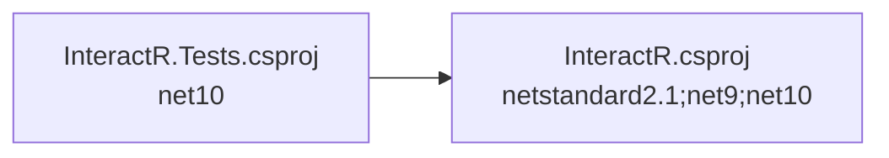

# .NET 10.0 Upgrade Plan — InteractR Solution

## Table of Contents

- [1. Executive Summary](#1-executive-summary)
- [2. Migration Strategy](#2-migration-strategy)
- [3. Detailed Dependency Analysis](#3-detailed-dependency-analysis)
- [4. Project-by-Project Plans](#4-project-by-project-plans)
  - [4.1 InteractR\InteractR.csproj](#41-interactrinteractrcsproj)
  - [4.2 Tests\InteractR.Tests.csproj](#42-testsinteractrtestscsproj)
- [5. Package Update Reference](#5-package-update-reference)
- [6. Breaking Changes Catalog](#6-breaking-changes-catalog)
- [7. Testing & Validation Strategy](#7-testing--validation-strategy)
- [8. Risk Management](#8-risk-management)
- [9. Complexity & Effort Assessment](#9-complexity--effort-assessment)
- [10. Source Control Strategy](#10-source-control-strategy)
- [11. Success Criteria](#11-success-criteria)

---

## 1. Executive Summary

### Scenario
Upgrade the InteractR solution from its current target frameworks to .NET 10.0 (LTS).

### Scope
| Metric | Value |
|--------|-------|
| Total Projects | 2 |
| Total NuGet Packages | 2 (all compatible, no updates needed) |
| Total Code Files | 26 |
| Total Lines of Code | 712 |
| API Issues | 0 |
| Security Vulnerabilities | 0 |

### Current State ? Target State

| Project | Current Framework | Proposed Framework |
|---------|------------------|--------------------|
| InteractR\InteractR.csproj | netstandard2.1;net9;net10 | netstandard2.1;net9;net10.0 |
| Tests\InteractR.Tests.csproj | net10 | net10.0 |

> **Note:** The existing `net10` TFM entries are non-standard shorthand. The upgrade normalizes these to the proper `net10.0` moniker. For the multi-targeted InteractR library, the existing `net10` entry should be replaced with `net10.0` (not duplicated).

### Selected Strategy
**All-At-Once Strategy** — All projects upgraded simultaneously in a single atomic operation.

**Rationale:**
- 2 projects (very small solution)
- All currently on modern .NET / netstandard2.1
- Simple, linear dependency structure (Tests ? InteractR)
- All NuGet packages already compatible with .NET 10.0
- Zero API incompatibilities or breaking changes detected
- 712 total LOC — minimal risk surface

### Complexity Classification
**Simple** — 2 projects, dependency depth of 1, no high-risk items, no security vulnerabilities. Fast-batch approach with 2-3 detail iterations.

### Critical Issues
None identified. No security vulnerabilities, no incompatible packages, no API breaking changes.

## 2. Migration Strategy

### Approach: All-At-Once

All projects are upgraded simultaneously in a single coordinated operation. There are no intermediate states — the solution moves directly from its current frameworks to .NET 10.0.

### Justification

| Criterion | Assessment | Supports All-At-Once? |
|-----------|-----------|----------------------|
| Project count | 2 projects | ? Well under 30 threshold |
| Dependency complexity | Linear chain, depth 1 | ? Simplest possible |
| Codebase size | 712 LOC total | ? Very small |
| Package compatibility | 100% compatible | ? No package migration work |
| API compatibility | 0 breaking changes | ? No code migration work |
| Security vulnerabilities | 0 | ? No urgent remediations |

### Execution Approach

The atomic upgrade consists of:

1. **Update all project files** — Normalize `TargetFramework` entries to use `net10.0` across both projects simultaneously
2. **Restore dependencies** — Ensure all packages resolve correctly for the updated TFMs
3. **Build solution and fix all compilation errors** — Verify the entire solution compiles cleanly
4. **Run tests** — Execute the test project to validate functional correctness

### No Intermediate States
Both project files are updated in the same operation. The solution is not expected to be in a partially-upgraded state at any point.

## 3. Detailed Dependency Analysis

### Dependency Graph

### Project Groupings

Since this uses the All-At-Once strategy, all projects are upgraded simultaneously as a single atomic operation. No phased migration is needed.

| Project | Type | Dependencies | Dependants |
|---------|------|-------------|------------|
| InteractR\InteractR.csproj | ClassLibrary (multi-targeted) | 0 | 1 (Tests) |
| Tests\InteractR.Tests.csproj | Test Project | 1 (InteractR) | 0 |

### Critical Path
Linear chain: `InteractR.csproj` ? `InteractR.Tests.csproj`

- **InteractR.csproj** is the leaf node (no project dependencies)
- **InteractR.Tests.csproj** depends on InteractR and is the root node
- No circular dependencies
- No parallel paths — single dependency chain

## 4. Project-by-Project Plans

### 4.1 InteractR\InteractR.csproj

**Current State:**
- **Target Frameworks:** `netstandard2.1;net9;net10` (multi-targeted)
- **Project Type:** ClassLibrary (SDK-style)
- **Dependencies:** 0 project dependencies, 0 NuGet packages
- **Dependants:** 1 (InteractR.Tests.csproj)
- **Files:** 16 | **LOC:** 342
- **Risk Level:** ?? Low

**Target State:**
- **Target Frameworks:** `netstandard2.1;net9.0;net10.0`
- **Updated Packages:** 0

**Migration Steps:**

1. **Update TargetFrameworks in `InteractR\InteractR.csproj`**
   - Change `<TargetFrameworks>netstandard2.1;net9;net10</TargetFrameworks>` to `<TargetFrameworks>netstandard2.1;net9.0;net10.0</TargetFrameworks>`
   - **Critical:** `net9` and `net10` without the `.0` suffix are interpreted as legacy .NET Framework monikers (e.g., .NET Framework 0.9 and 1.0), not modern .NET 9/10. This is the root cause of the build failure. The correct TFMs are `net9.0` and `net10.0`.
   - `netstandard2.1` remains unchanged — it is a valid cross-platform target

2. **No package updates required** — all packages are compatible

3. **No code modifications expected** — 0 API incompatibilities detected

**Validation Checklist:**
- [ ] `TargetFrameworks` element reads `netstandard2.1;net9.0;net10.0`
- [ ] Project builds without errors for all three target frameworks
- [ ] No build warnings related to framework targeting

---

### 4.2 Tests\InteractR.Tests.csproj

**Current State:**
- **Target Framework:** `net10` (single-targeted)
- **Project Type:** Test Project (SDK-style, NUnit)
- **Dependencies:** 1 project (InteractR.csproj), 2 NuGet packages
- **Dependants:** 0
- **Files:** 10 | **LOC:** 370
- **Risk Level:** ?? Low

**Target State:**
- **Target Framework:** `net10.0`
- **Updated Packages:** 0

**Migration Steps:**

1. **Update TargetFramework in `Tests\InteractR.Tests.csproj`**
   - Change `<TargetFramework>net10</TargetFramework>` to `<TargetFramework>net10.0</TargetFramework>`
   - Same root cause as InteractR.csproj: `net10` resolves to .NET Framework 1.0, not .NET 10.0

2. **No package updates required:**
   - NUnit 4.5.0 — ? Compatible
   - NUnit3TestAdapter 6.1.0 — ? Compatible

3. **No code modifications expected** — 0 API incompatibilities detected

**Validation Checklist:**
- [ ] `TargetFramework` element reads `net10.0`
- [ ] Project builds without errors
- [ ] All unit tests pass

## 5. Package Update Reference

### Common Package Updates

No package updates are required. All NuGet packages are already compatible with .NET 10.0.

| Package | Current Version | Suggested Version | Projects | Status |
|---------|----------------|-------------------|----------|--------|
| NUnit | 4.5.0 | — | InteractR.Tests.csproj | ? Compatible |
| NUnit3TestAdapter | 6.1.0 | — | InteractR.Tests.csproj | ? Compatible |

> **Note:** InteractR.csproj has zero NuGet package dependencies.

## 6. Breaking Changes Catalog

### TFM Normalization (Root Cause of Build Failure)

The primary issue in this upgrade is **not** a breaking API change but an **incorrect Target Framework Moniker (TFM)** format:

| Incorrect TFM | Interpreted As | Correct TFM | Interpreted As |
|---------------|---------------|-------------|----------------|
| `net9` | .NET Framework 0.9 (invalid) | `net9.0` | .NET 9.0 |
| `net10` | .NET Framework 1.0 | `net10.0` | .NET 10.0 |

The `netX` format (without `.0`) follows the legacy .NET Framework naming convention. Modern .NET versions require the `netX.0` format.

### API Breaking Changes

No API breaking changes were detected by the analysis:
- 0 binary incompatible APIs
- 0 source incompatible APIs
- 0 behavioral changes
- 361 APIs analyzed, all compatible

### Expected Compilation Issues

None expected after TFM correction. The codebase uses standard APIs that are fully compatible with .NET 10.0.

## 7. Testing & Validation Strategy

### Build Validation

After the atomic upgrade, the entire solution must build with 0 errors:
- `InteractR.csproj` must build successfully for all three targets: `netstandard2.1`, `net9.0`, `net10.0`
- `InteractR.Tests.csproj` must build successfully for `net10.0`

### Test Execution

**Test project:** `Tests\InteractR.Tests.csproj`
- Framework: NUnit 4.5.0 with NUnit3TestAdapter 6.1.0
- All existing unit tests must pass
- Test file: `Tests\HubTests.cs` contains integration tests for the InteractR hub, middleware pipeline, and global middleware

### Validation Sequence
1. Build entire solution — expect 0 errors
2. Run all tests in `InteractR.Tests.csproj` — expect all tests pass
3. Verify no new build warnings related to framework targeting

## 8. Risk Management

### Risk Assessment

| Project | Risk Level | Rationale |
|---------|-----------|----------|
| InteractR.csproj | ?? Low | 342 LOC, 0 package updates, 0 API issues, no security vulnerabilities |
| InteractR.Tests.csproj | ?? Low | 370 LOC, 0 package updates, 0 API issues, compatible test framework |

### Identified Risks

| Risk | Likelihood | Impact | Mitigation |
|------|-----------|--------|------------|
| Multi-target build failure on `netstandard2.1` after TFM change | Low | Medium | Build solution immediately after change; `netstandard2.1` target is unchanged so risk is minimal |
| NUnit test adapter incompatibility with .NET 10.0 | Low | Low | Both NUnit packages confirmed compatible by analysis; rollback TFM if unexpected failure |

### Contingency Plan

If the upgrade encounters unexpected issues:
1. Revert TFM changes in both project files
2. Investigate specific build errors
3. The upgrade branch (`upgrade-to-NET10`) isolates changes from `master`

## 9. Complexity & Effort Assessment

### Per-Project Complexity

| Project | Complexity | LOC | Package Updates | API Changes | Dependencies |
|---------|-----------|-----|----------------|-------------|-------------|
| InteractR.csproj | ?? Low | 342 | 0 | 0 | 0 projects, 0 packages |
| InteractR.Tests.csproj | ?? Low | 370 | 0 | 0 | 1 project, 2 packages |

### Overall Assessment

- **Solution Complexity:** ?? Low
- **Change Scope:** TFM normalization only — no code changes, no package updates
- **Dependency Ordering:** Single linear chain, no complexity
- **Resource Requirements:** Standard .NET development skills sufficient

## 10. Source Control Strategy

### Branch Strategy

- **Source branch:** `master`
- **Upgrade branch:** `upgrade-to-NET10` (already created)
- All upgrade changes are made on the `upgrade-to-NET10` branch

### Commit Strategy

**Single commit** for the entire upgrade — both project file changes, build verification, and test validation are committed as one atomic unit.

- Commit message format: `Upgrade InteractR solution to .NET 10.0`
- Includes TFM normalization for both project files

### Merge Process

1. Verify all builds pass and all tests pass on `upgrade-to-NET10`
2. Merge `upgrade-to-NET10` into `master` (or create a pull request for review)

## 11. Success Criteria

### Technical Criteria

- [ ] `InteractR.csproj` targets `netstandard2.1;net9.0;net10.0`
- [ ] `InteractR.Tests.csproj` targets `net10.0`
- [ ] Entire solution builds with 0 errors
- [ ] All unit tests in `InteractR.Tests.csproj` pass
- [ ] No package dependency conflicts
- [ ] No security vulnerabilities

### Quality Criteria

- [ ] Code quality maintained (no functional changes)
- [ ] Test coverage maintained (same tests, same coverage)

### Process Criteria

- [ ] All-At-Once strategy followed — single atomic upgrade operation
- [ ] Changes isolated on `upgrade-to-NET10` branch
- [ ] Single commit for entire upgrade
